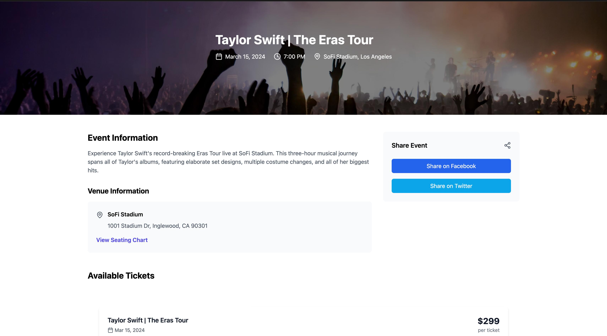

# Resell Rally - Secure Ticket Marketplace

## Overview

Resell Rally is a modern, secure ticket marketplace platform that connects buyers and sellers for events ranging from concerts and sports to theater and comedy shows. Built with security and user experience in mind, it provides a reliable platform for secondary ticket sales.

## 🌟 Key Features

- **Secure Authentication**: JWT-based user authentication system
- **Real-time Ticket Management**: Live updates for ticket availability and pricing
- **Secure Payments**: Integrated with Razorpay for secure transactions
- **User Dashboard**: Comprehensive dashboard for managing tickets and transactions
- **Event Discovery**: Advanced search and filtering capabilities
- **Responsive Design**: Seamless experience across all devices

## 🚀 Technology Stack

### Frontend
- React 18 with TypeScript
- Tailwind CSS for styling
- Lucide React for icons
- React Router for navigation
- Context API for state management

### Backend
- Django 5.0
- Django REST Framework
- JWT Authentication
- SQLite/PostgreSQL
- Razorpay Integration

## 📸 Screenshots

### Homepage


### Event Details


### Ticket listing


### User Dashboard


## 🛠️ Installation & Setup

### Prerequisites
- Node.js (v18 or higher)
- Python (v3.11 or higher)
- pip
- virtualenv

### Backend Setup
```bash
# Create and activate virtual environment
python -m venv venv
source venv/bin/activate  # On Windows: venv\Scripts\activate

# Install dependencies
cd backend
pip install -r requirements.txt

# Run migrations
python manage.py migrate

# Start server
python manage.py runserver
```

### Frontend Setup
```bash
# Install dependencies
npm install

# Start development server
npm run dev
```

## 💡 Usage

1. **For Buyers**:
   - Browse available events
   - Search by category, location, or date
   - Purchase tickets securely
   - View ticket details in dashboard

2. **For Sellers**:
   - List tickets for sale
   - Set pricing and details
   - Track sales and earnings
   - Manage active listings

## 🔒 Security Features

- JWT Authentication
- Secure payment processing
- Input validation and sanitization
- Protected API endpoints
- Ticket verification system

## 🤝 Contributing

1. Fork the repository
2. Create your feature branch (`git checkout -b feature/AmazingFeature`)
3. Commit your changes (`git commit -m 'Add some AmazingFeature'`)
4. Push to the branch (`git push origin feature/AmazingFeature`)
5. Open a Pull Request

